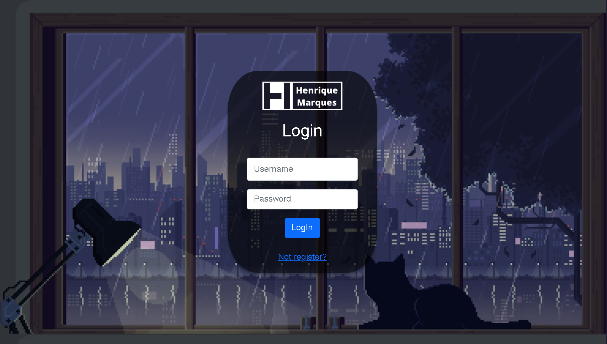
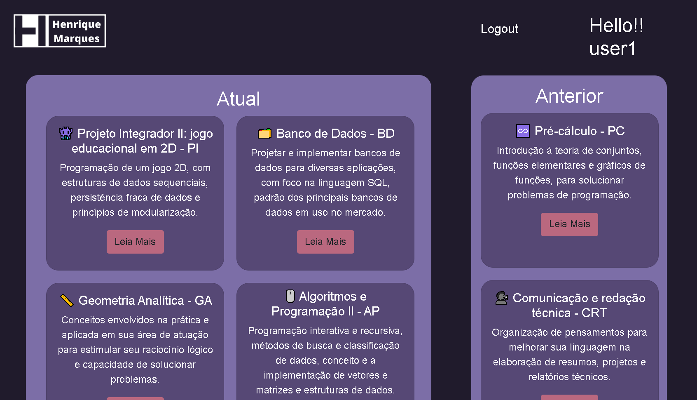
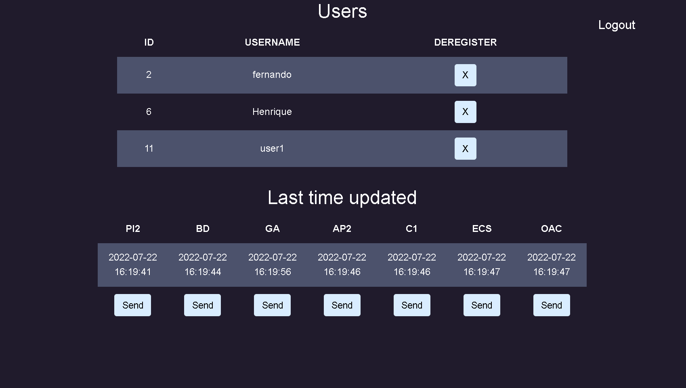

# GainProgress
#### Video Demo:  <https://youtu.be/m1JQN_vB9rA>
#### Description:
Gain progress is a web-based application that will essentially be used to help some of my college friends in their studies in a subtle way. Everyday when I for the most part come back home from college, I for all intents and purposes take all my notes for the day and transfer them to a web application called "NOTION\" as a way to review part of the content and make it much more accessible so that I can study at any time without having to carry my notebook everywhere in a basically big way.
Sometimes some of my friends would basically ask me to essentially pass these notes to them to actually help with their study, which is fairly significant. However, the process of getting this content and passing it on to them mostly is a bit tedious, so my application automates it. So everyone can access the contents through just one login.

All the web-aplication funcionalities could be seen [here](https://www.youtube.com/watch?v=7sZx3Qsw1eQ)

In my project, Python is used along with the Flask framework to control the application’s backend as well as routes, forms and some interactivity inside of the database, that was based in SQL in a particularly big way. In the frontend I used HTML with some for the most part help from the Jinja2 syntax to template every page. At the CSS, I customize a lot to look as well as I thought and to facilitate this process I used some Bootstrap. The JavaScript in the process was used to basically give dynamics to the page in an important way.

The development process was quite exhausting, because in the problem sets and in the labs a lot definitely was given to us to speed up and help that there actually were no bugs so routinely. I often found myself really stuck trying to work with CSS attributes having to rearrange HTML tags pretty many times. Giving dynamism to the web application was not that difficult despite not having worked definitely much with Javascript throughout the course.

This aplication basically works with seven routes. There are Index, Register, Login, Logout, Admin, Deregister and lastTimeUpdated. Witch of them makes something completelly different.
Index: The function first checks to see if the user has logged in, and then it returns a redirect to /login if they have no and renders an HTML template called index.html
Register: This function is used to handle the user registration process.
Login: This function is used to log the user in.
Logout: This function is used to log the user out.
Admin: The code will return a list of all users in the database that have logged in as well as a table with averytime the list got updated.
Deregister: Is a function that only the damin has acsses that allows it to deregister someone from the database.

#### Tecnologies Used:
Python, Flask, SQL, HTML, Jinja2, CSS, Bootstrap and JavaScript